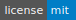

# ANANSE: ANalysis Algorithm for Networks Specified by Enhancers


[](http://bioconda.github.io)
[](https://badge.fury.io/py/ANANSE)


### Prediction of key transcription factors in cell fate determination using enhancer networks


> (A), Illustration of all the data used to predict key TFs in cell conversion. Those data include the enhancer database from ATAC-seq, DNase-seq or p300 ChIP-seq, the motif score of all TFs and the gene expression data of each cell type from RNA-seq. (B), The predicted cell-type specific TF binding profiles from enhancer database and TF's motif score in each cell type. (C), The predicted cell-type specific GRN based on TF/Gene binding, TF/Gene expression and its' distance. (D), The GRN difference between two interested cell types. (E), The ranked influence score of all TFs calculated from GRN.


---

## Quick start

* ### **Installation**

  * The most straightforward way to install ANANSE is by using [bioconda](https://bioconda.github.io/). If you have not used bioconda before, first install [conda](https://docs.continuum.io/anaconda/) and then set up the necessary channels (in this order!). You only have to do this once.

    ```
    $ conda config --add channels defaults
    $ conda config --add channels bioconda
    $ conda config --add channels conda-forge
    ```

  * Now you can install ANANSE:

    ```
    # Install all dependencies, and Python 3 is the required.
    $ conda create -n ananse python=3 gimmemotifs=0.14.0 networkx chest dask pytables adjusttext

    # Activate the environment
    $ conda activate ananse 

    # Download the genome of interest.
    $ genomepy install hg38 UCSC --annotation
    
    # Install ANANSE development version package from github
    $ pip install git+https://github.com/vanheeringen-lab/ANANSE.git@develop
    ```

  * For most of the analyses it is beneficial to use as many threads as possible for the motif analysis. This is configured by the GimmeMotifs config file. If you haven't done so, run `gimme`, which will create a new GimmeMotifs config file `~/.config/gimmemotifs/gimmemotifs.cfg`, and change the `ncpus` parameter.


* ### **Usage**
  
  * **All the example dataset and result files are able to find at [***http://mbdata.science.ru.nl/qxu/ananse/ananse.html***](http://mbdata.science.ru.nl/qxu/ananse/ananse.html).**
  ---
  > ### ***Build TF binding network***

  * Example:
    ```
    $ ananse binding  -r data/krt_enhancer.bed \
                      -o results/binding.txt \
                      -a /data/hg38_genes.bed \
                      -g hg38 \
                      -p /data/gimme.vertebrate.v5.1.pfm
    ```

  * Required arguments:
    * `-r, --enhancers`  
      The name of the input enhancer peak file. This should be a BED format file, with 4 columns. The first column is chromosome name, the second and third columns are the start and end point of peak. We recommend all peaks have 200bp. If the peak is not 200bp, we will normize it to 200bp. The fourth column is intensity of the peak, it could be RPKM or equivalent value. [***This***](/test/data/krt_enhancer.bed) is an example enhancer BED file.
    * `-o, --output`  
      The name of the output file.


  * Optional arguments:
    
    * `-g, --genome`  
      The genome of your data. For example, hg38. The genome is recommended to download by `genomepy`. The default setting is hg19.
    * `-a, --annotation`  
      The input 12 columns BED file with gene annotation in your genome version. [***This***](/data/hg38_genes.bed) is an example BED annotation file of human hg38.
    * `-p, --motifs`  
      The input Motif file. [***This***](/data/gimme.vertebrate.v5.1.pfm) is an example Motif file in vertebrate. if provided there should also be a motif2factors.txt file and a factortable.txt file in the same folder. [***This***](/data/gimme.vertebrate.v5.1.motif2factors.txt) is an example of motif2factors file. [***This***](/data/gimme.vertebrate.v5.1.factortable.txt) is an example of factortable file.
    * `-f, --filter_promoter`  
      Filter promoters, True or False, input should be
      either 'True' or 'False'. (Default setting: True; if 'True', the function will filtered all promoter peaks (+-2k from TSS) in provided enhancer peaks.).
    * `-d, --keep_detail`  
      Keep detail files, True or False, input should be either 'True' or 'False'. (Default setting: True).  
    * `-h, --help`  
      Show the help message and exit.

  ---
  > ### ***Built gene regulatory network***

  * Example:
    ```
    $ ananse network  -e data/KRT_rep1_TPM.txt data/KRT_rep2_TPM.txt \
                      -r data/krt_enhancer.bed \
                      -b results/binding.txt \
                      -o results/full_features.txt \
                      -a /data/hg38_genes.bed \
                      -g hg38 \
                      -c expressioncorrelation.txt \
                      -p ../data/gimme.vertebrate.v5.1.pfm
    ```

  * Required arguments:
    * `-e, --expression`  
      The expression file of your interested cell type or tissue. It could have one or more gene expression file(s). In this file, the 1st column should contain gene name, and a column should be named TPM. [***This***](/test/data/KRT_rep1_TPM.txt) is an example of expression file.   
    * `-r, --enhancers`  
      The name of the input enhancer peak file. This should be a BED format file, with 4 columns. The first column is chromosome name, the second and third columns are the start and end point of peak. We recommend all peaks have 200bp. If the peak is not 200bp, we will normize it to 200bp. The fourth column is intensity of the peak, it could be RPKM or equivalent value. [***This***](/test/data/krt_enhancer.bed) is an example enhancer BED file.
    * `-b, --binding`  
      The binding network from `Build binding network` step. One of the example `binding network` could be found at [***here***](http://mbdata.science.ru.nl/qxu/ananse/results/binding.txt).  
    * `-o, --output`  
      The folder to save results, `-o` is the required arguments. 

  * Optional arguments:
    * `-g, --genome`  
      The genome of your data. For example, hg38. The genome is recommended to download by `genomepy`.
    * `-p, --motifs`  
      The input Motif file. [***This***](/data/gimme.vertebrate.v5.1.pfm) is an example Motif file in vertebrate. if provided there should also be a motif2factors.txt file and a factortable.txt file in the same folder. [***This***](/data/gimme.vertebrate.v5.1.motif2factors.txt) is an example of motif2factors file. [***This***](/data/gimme.vertebrate.v5.1.factortable.txt) is an example of factortable file. 
    * `-a, --annotation`  
      The input 12 columns BED file with gene annotation in your genome version. [***This***](/data/hg38_genes.bed) is an example BED annotation file of human hg38.
    * `-f, --filter_promoter`  
      Filter promoters, True or False, input should be
      either 'True' or 'False'. (Default setting: True; if 'True', the function will filtered all promoter peaks (+-2k from TSS) in provided enhancer peaks.).
    * `-c, --corrfiles`  
      All gene correlation file, the human gene expression correlation can be found at [***here***](http://mbdata.science.ru.nl/qxu/ananse/data/expressioncorrelation.txt).
    * `-h, --help`  
      Show the help message and exit.

  ---
  > ### ***Infer TF influence score***

  * Example:
    ```
    $ ananse influence  -a results/full_network.txt \
                        -e data/FB_rep1_TPM.txt \
                        -d data/FB2KRT_degenes.csv \
                        -o results/FB2KRT.txt \
                        -p False
    ```

  * Required arguments:
  
    * `-a, --anetwork`  
    The network in second cell. It is the result from `Built GRN` step. One of the example `network` could be found at [***here***](http://mbdata.science.ru.nl/qxu/ananse/results/full_network.txt).   
    * `-d, --degenes`  
    The differential expression table between two cells. [***This***](/test/data/FB2KRT_degenes.csv) is an example of differential expression file.  
    * `-o, --output`  
    The folder to save results, `-o` is the required arguments.   

  * Optional arguments:

    * `-b, --bnetwork`  
    The network in first cell (optional). It is the result from `Built GRN` step. One of the example `network` could be found at [***here***](http://mbdata.science.ru.nl/qxu/ananse/results/full_network.txt).  
    * `-e, --expression`  
    The gene expression in first cell (optional). One or more gene expression file(s), 1st column should contain gene name, and a column should be named TPM. [***This***](/test/data/FB_rep1_TPM.txt) is an example of expression file. 
    * `-p, --plot`  
    Plot influence. True or False, input should be either 'True' or 'False'. (Default setting: True)  
    * `-h, --help`  
    Show the help message and exit.


* ### **API documentation**

  * The ***python API documentation*** of this package can be found here:  
    * [`Binding` class](/docs/api_binding.md).
    * [`Network` class](/docs/api_network.md).
    * [`Influence` class](/docs/api_influence.md).

---
## Help

  * The preferred way to get support is through the Github issues page

---

## Support

  Reach out to me at one of the following places!

  - Website at <a href="https://github.com/vanheeringen-lab" target="_blank">`vanheeringen-lab`</a>
  - Email to <a href="mailto:qxuchn@gmail.com" target="_blank">`Quan Xu`</a> or <a href="mailto:simon.vanheeringen@gmail.com" target="_blank">`Simon J. van Heeringen`</a>

---

## License

  [](http://badges.mit-license.org)

  - **[MIT license](http://opensource.org/licenses/mit-license.php)**
  - Copyright 2019 © <a href="https://github.com/vanheeringen-lab" target="_blank">vanheeringen-lab</a>.
