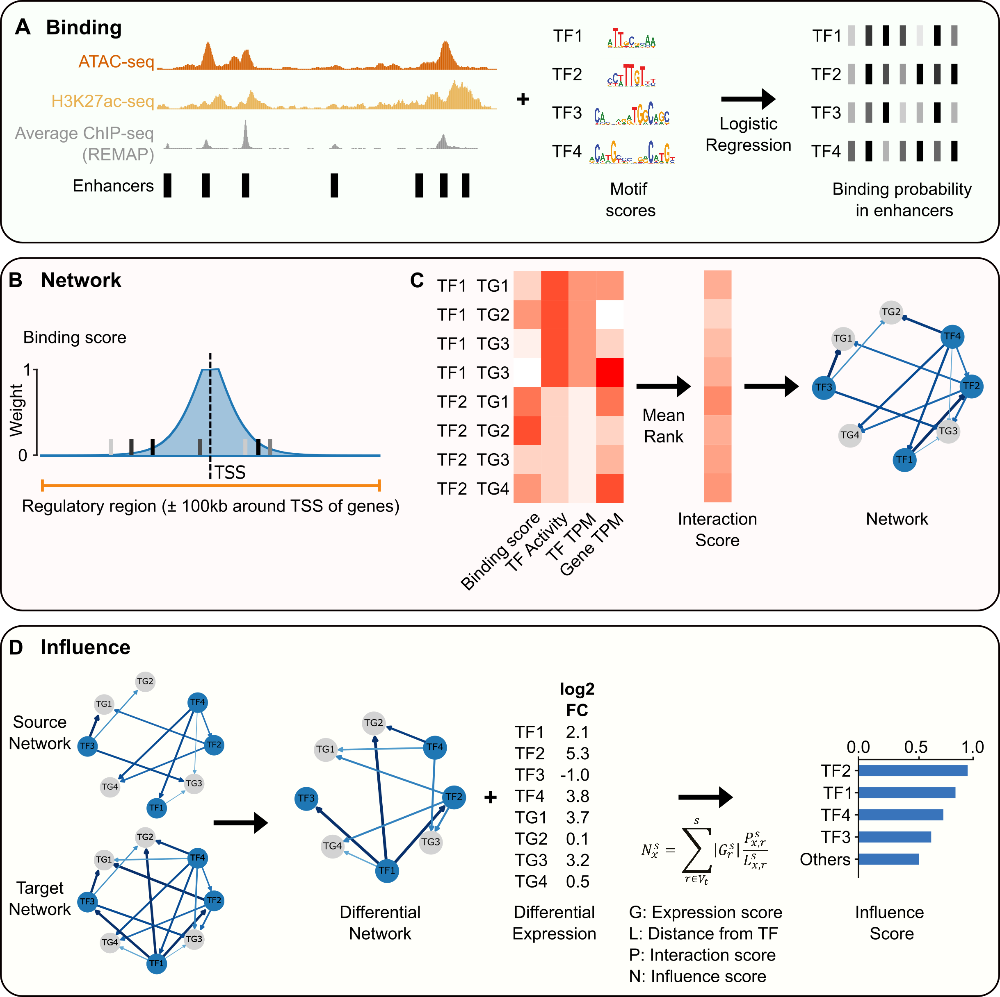

## Model description

### Overview of ANANSE

The following is overview of the full workflow that ANANSE uses to prioritize transcription factors for cellular fate changes. ANANSE infers gene regulatory networks (GRNs) to predict key transcription factors (TFs) that drive cellular transitions.

### Prediction of transcription factor binding

The enhancer intensity is combined with sequence features in enhancer peaks to infer cell type-specific TF binding profiles (**A** in the figure).  

ANANSE uses a logistic classifier, trained on ChIP-seq peaks of 237 TFs (from the [REMAP database](http://remap.univ-amu.fr/)). The classifier combines the ATAC-seq signal, the H3K27ac signal and the motif score to predict the probability of binding. When the default enhancer regions are used (based on combining all ChIP-seq data from REMAP), the classifier also uses the average ChIP-seq signal, which improves the performance. 

### Inference of gene regulatory networks

ANANSE infers cell type-specific GRNs based on the predicted TF binding sites, the predicted TF activity score, and the expression levels both TFs as well as their target genes (see **B**). TF-gene interaction scores, the edge weights in the network, are calculated based on the predicted TF binding probability, the distance between the enhancer and the target gene, and expression of both TF and the target gene. By integrating these data using mean rank aggegation, ANANSE determines the interaction score of each TF-gene pair. 

The weighted sum of TF predicted enhancer intensity within 100kb around TSS is defined as the TF-gene binding score (Eq. 1). 

<!-- \begin{equation*} -->
$$ B_{x,r} = \sum_{k} w_k s_k \tag{1} $$
<!-- \end{equation*} -->

where \\(B_{x,r}\\) is the binding score between TF \\(x\\) and target gene \\(r\\), \\(w_k\\) is the weighted distance between an enhancer and the target gene and where \\(s_k\\) is predicted binding intensity at genomic position \\(k\\) of TF \\(x\\). 

The distance weight is based on a linear genomic distance between the enhancer and the TSS of a gene according to: 

\begin{equation}
w_k =
  \begin{cases}
    0               & \quad k \in (\text{0kb,2kb}] \\\\
    1               & \quad k \in (\text{2kb,5kb}] \\\\
    \frac{2e^{-\mu|k-t_r|}}{1+e^{-\mu|k-t_r|}}  & \quad k \in (\text{5kb,100kb}]
  \end{cases} \tag{2}
\end{equation}

where \\(t_r\\) is the genomic position of the TSS of gene s\\(r\\) and the parameter \\(\mu\\), which determines the decay rate as a function of distance from the TSS, is set such that an enhancer 10 kb from the TSS contributes one-half of that at the TSS. This distance weight calculation is similar to the method previously described in Wang et al., 2016, except that only signal in enhancers is used, enhancers within 2kb around TSS are removed and the weight of enhancers within 2kb to 5kb is set to 1.

We scaled the expression level of the TF \\(E_x\\) and the target gene \\(E_r\\), expressed as transcripts per million (TPM), and the TF-gene binding score \\(B_{x,r}\\) we calculated in the first step from 0 to 1, with 1 being the highest and 0 the lowest. Combining the TF-gene binding score and TF and target expression scores by taking the mean, we obtained a TF-gene interaction score, \\(I_{x,r}\\):

\begin{equation}
I_{x,r} = \frac{B_{x,r} + E_x + E_r}{3} \tag{3}
\end{equation}

### Calculation of influence score

To calculate the influence score for the transition from a source cell type to a target cell type, a differential GRN i used. This network consists of the difference of the interaction score (edge weight) between a *source* and a *target* cell type. A local network is used for each TF, up to a maximal number of three edges. A target score isscalculated for each node in the network, based on 1) its edge distance from the TF of interest, 2) the interaction score and 3) the change in expression between the source cell type and the target cell type. The target score for each TF is defined as the sum of the scores from all the nodes in its local network. Nodes present in multiple edges are calculated only for the edge closest to the TF of interest. Self-regulating nodes are not considered. The target score and the expression of each TF are scaled from 0 to 1, and the mean is defined as the influence score of this TF. 
